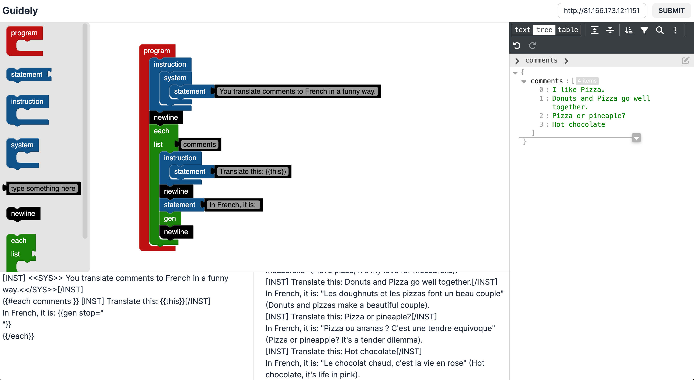

# Guidely Client

Guidely frontend. Make sure to follow instructions for running the [guidely-server](https://github.com/quietrocket/guidely-server).

## What's guidely?

Guidely is an interface over Microsoft's [Guidance Framework](https://github.com/microsoft/guidance). It uses the Google's [Blockly](https://developers.google.com/blockly) library to provide a visual interface for creating and editing Guidance programs. Not only does it generate the handlebar syntax, it also runs the Guidance program and streams the result using Server Sent Events.

The goal is to eventually implement all the instructions and options of the Guidance framework + more.

## Getting Started

1. Follow the instructions for running the [guidely-server](https://github.com/quietrocket/guidely-server).
2. Run the UI:
   - Locally:
     a. Clone this repo.
     b. Run `npm install` or `yarn install` or `pnpm install`.
   - Deploy to Vercel.
3. Open the UI
4. Copy your Vast.ai host and port into the input field as such: `http://<host>:<port>/llm`.
